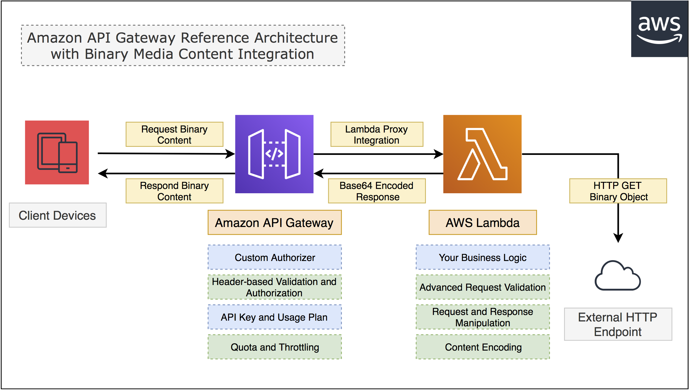
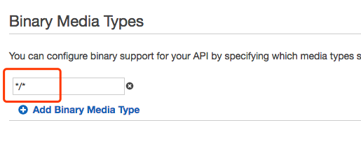

## Amazon API Gateway Reference Architecture with Binary Content Integration

This reference walks you through how to build Amazon API Gateway and `Lambda proxy` integration with `Binary Metia Types` support.




# Build

```bash
# git clone
git clone https://github.com/pahud/amazon-apigateway-binary-refarch.git
cd amazon-apigateway-binary-refarch

# npm install required modules into ./node_modules
npm install

# edit Makefile and modify 
# S3BUCKET ?= pahud-tmp-cn-north-1 // your temporary S3 bucket which you have write access
# LAMBDA_REGION ?= cn-north-1 // the AWS region you are deploying to 
# LAMBDA_FUNC_NAME ?= apig-binary-proxy  // your lambda function name
# AWS_PROFILE ?= default // your aws profile name

# build, package and deploy 
make func-prep sam-package sam-deploy
```

Behind the scene, cloudformation will deploy your stack to your target region and you'll see the response like this:

```json
[
    {
        "OutputKey": "URL", 
        "OutputValue": "https://9iff43tcvk.execute-api.cn-north-1.amazonaws.com.cn/Prod/whatever-uri"
    }
]
```

You may test the URL with different `User-Agent` header and different request URI.


# Update API Gateway Setting

Turn on the `Binary Media Types` support by entering `*/*`in the API Gateway setting.



And re-deploy your API Gateway again.

Now you should be able to see the binary response.

# Clean up

```bash
# detroy all the resources previously provisioned
make destroy
```

